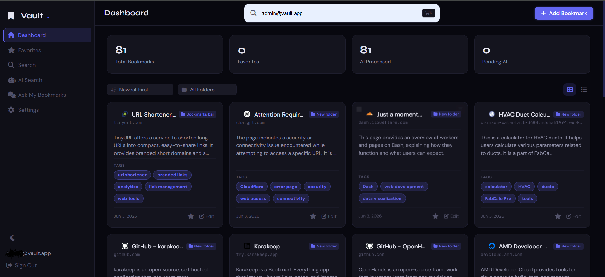
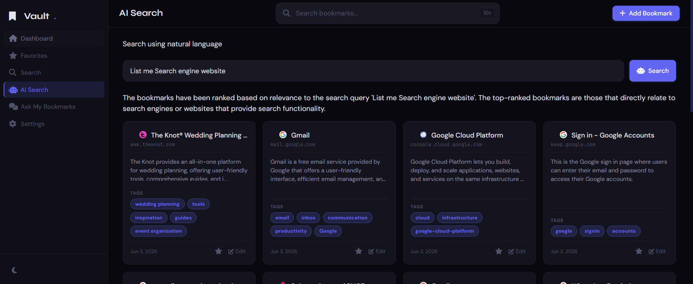
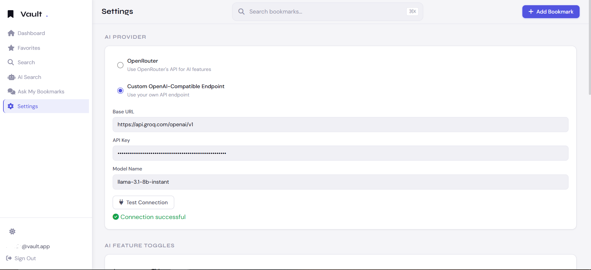

# 🏦 AI Bookmark Vault

> **Your private, intelligent bookmark command center.**  
> Save links → AI reads them → Find anything with natural language.  
> *No ads, no tracking, no nonsense.*


---

## ✨ What It Does

Imagine if your bookmarks folder had a **PhD in organization**. That's this.

| Feature | What Happens |
|---------|-------------|
| 🔖 **Save a link** | AI auto-generates title, summary & tags from the page content |
| 🔍 **Search normally** | Full-text search across URLs, titles, notes, tags |
| 🤖 **AI Search** | Type "that article about rust concurrency patterns" — it finds it |
| 💬 **Ask My Bookmarks** | Chat with your entire collection like it's a second brain |
| ⭐ **Favorites** | Star the good stuff |
| 📤 **Export** | JSON or CSV — take your data anywhere |
| ⚡ **Bulk AI Sync** | Got an API key with huge limits? Process everything at once with a live progress bar |

---

## 🖼️ Screenshots

| Dashboard | AI Search | Settings |
|-----------|-----------|----------|
|  |  |  |

---

## 🧱 Tech Stack

```
┌─────────────────────────────────────────────────────────┐
│                     🌐 Frontend                          │
│   HTML5 · CSS3 · Vanilla JS · Font Awesome · AOS.js    │
├─────────────────────────────────────────────────────────┤
│                     ⚡ Backend (Worker)                   │
│   Cloudflare Workers · JavaScript · JWT Auth            │
├─────────────────────────────────────────────────────────┤
│                     🗄️ Database                          │
│   Cloudflare D1 (SQLite-based, serverless)              │
├─────────────────────────────────────────────────────────┤
│                     🧠 AI Layer                          │
│   OpenRouter · Custom OpenAI-Compatible Endpoints       │
└─────────────────────────────────────────────────────────┘
```

---

## 📁 Project Structure

```
📂 AIBV/
│
├── 📄 index.html                 # 🚪 Login / Register page
├── 📄 dashboard.html             # 🏠 Main app — all views live here
│
├── 📂 css/
│   └── 📄 styles.css             # 🎨 Complete design system (dark/light)
│
├── 📂 js/
│   ├── 📄 api.js                 # 🔌 API client — talks to the worker
│   ├── 📄 auth.js                # 🔐 Login, register, token management
│   ├── 📄 bookmarks.js           # 📚 CRUD, rendering, favorites, bulk ops
│   ├── 📄 search.js              # 🔍 Standard full-text search
│   ├── 📄 ai-search.js           # 🤖 Natural language AI search
│   ├── 📄 ask-bookmarks.js       # 💬 Conversational Q&A with your bookmarks
│   ├── 📄 settings.js            # ⚙️ AI provider config, toggles, AI Sync
│   ├── 📄 import-export.js       # 📥📤 Chrome/Firefox HTML import + JSON/CSV export
│   ├── 📄 ui.js                  # 🧩 Toasts, modals, cards, skeletons, helpers
│   └── 📄 dashboard-init.js      # 🚀 View switching, theme, init logic
│
├── 📂 worker/
│   └── 📄 worker.js              # ⚡ Single-file Cloudflare Worker (entire backend)
│
├── 📄 wrangler.toml              # ⚙️ Worker config (name, D1 binding)
├── 📄 .gitignore                 # 🙈 Files git should ignore
└── 📄 readme.md                  # 📖 You are here ✨
```

---

## 🚀 Deploy Your Own Vault

### Prerequisites

- A [Cloudflare](https://cloudflare.com) account
- Node.js installed (for Wrangler CLI)
- An API key from [OpenRouter](https://openrouter.ai) or any OpenAI-compatible provider

### Step 1: Install Wrangler

```bash
npm install -g wrangler
```

### Step 2: Login to Cloudflare

```bash
wrangler login
```

### Step 3: Create the D1 Database

```bash
wrangler d1 create bookmark-vault
```

Grab the returned `database_id` and put it in `wrangler.toml`:

```toml
[[d1_databases]]
binding = "DB"
database_name = "bookmark-vault"
database_id = "your-d1-database-id-here"   # ← Replace this
```

### Step 4: Set Secrets

```bash
# Required — used to sign JWT tokens
wrangler secret put JWT_SECRET
# → Type a random secure string (e.g., "my-super-secret-key-change-me")

# Optional — default API key for AI features
wrangler secret put OPENROUTER_KEY
# → Type your OpenRouter API key (or set it later in Settings UI)
```

### Step 5: Deploy the Worker

```bash
wrangler deploy
```

Your worker will be live at:  
`https://bookmark-vault-worker.YOUR_SUBDOMAIN.workers.dev`

### Step 6: Deploy the Frontend

```bash
# Create a Pages project and deploy
npx wrangler pages deploy . --project-name=bookmark-vault --branch=main
```

Your vault will be live at:  
`https://main.bookmark-vault-a64.pages.dev`

### Step 7: Create Your Account

Hit the login page, click **Register**, or use curl:

```bash
curl -X POST https://your-worker.workers.dev/api/auth/register \
  -H "Content-Type: application/json" \
  -d '{"email":"you@example.com","password":"your-password-here"}'
```

### Step 8: Configure AI

1. Go to **Settings → AI Provider**
2. Choose **OpenRouter** (or **Custom** for a custom endpoint)
3. Enter your API key and model (e.g., `openai/gpt-4o-mini`)
4. Click **Test Connection** ✅
5. Toggle features on/off as you like

---

## 🧪 API Endpoints

| Method | Endpoint | Auth | What it does |
|--------|----------|------|-------------|
| `POST` | `/api/auth/register` | ❌ | Create account |
| `POST` | `/api/auth/login` | ❌ | Sign in |
| `GET` | `/api/bookmarks` | ✅ | List bookmarks (paginated) |
| `POST` | `/api/bookmarks` | ✅ | Add a bookmark |
| `GET` | `/api/bookmarks/:id` | ✅ | Get one bookmark |
| `PUT` | `/api/bookmarks/:id` | ✅ | Edit a bookmark |
| `DELETE` | `/api/bookmarks/:id` | ✅ | Delete a bookmark |
| `POST` | `/api/bookmarks/:id/favorite` | ✅ | Toggle ⭐ |
| `POST` | `/api/bookmarks/:id/retry-ai` | ✅ | Retry failed AI processing |
| `POST` | `/api/ai-sync` | ✅ | Bulk process ALL pending/failed bookmarks |
| `GET` | `/api/search?q=` | ✅ | Full-text search |
| `POST` | `/api/ai-search` | ✅ | AI-ranked semantic search |
| `POST` | `/api/ask` | ✅ | Chat with your bookmarks |
| `GET` | `/api/settings` | ✅ | Read settings |
| `POST` | `/api/settings` | ✅ | Save a setting |
| `PUT` | `/api/auth/change-password` | ✅ | Change password |
| `GET` | `/api/export/json` | ✅ | Export as JSON |
| `GET` | `/api/export/csv` | ✅ | Export as CSV |

---

## 🎨 Design Notes

- **Dark mode by default** with instant light/dark toggle 🌗
- **No build step** — it's plain HTML/CSS/JS. Edit → refresh → done.
- **Responsive** — works on desktop & mobile
- **Single worker file** — the entire backend is `worker/worker.js`. That's it.

---

## 🤝 Contributing

PRs welcome! If you find a bug or have an idea:

1. Fork it 🍴
2. Branch it 🌿
3. Fix it 🔧
4. Ship it 🚀

---

## 🏗️ Built With

This project is a testament to what happens when you let **two AIs argue about code** while a human drinks coffee.

| Role | Tool | Cost |
|------|------|------|
| 🧠 **Architecture & Planning** | [Claude](https://claude.ai) — Designed the DB schema, API routes, auth flow, and file structure | 💵 **$0.00** (Claude is free tier gigachad) |
| 🤖 **All Development & Debugging** | [DeepSeek V4 Flash Reasoning API](https://deepseek.com) — Wrote every line of JS, HTML, CSS, worker logic, fixed bugs, deployed to Cloudflare | 💰 **$0.50** (yes, fifty cents — total) |
| 🛠️ **IDE** | VS Code with GitHub Copilot agent mode — continuous fix-and-deploy loop | 🆓 Included |
| ☁️ **Infrastructure** | Cloudflare Workers + D1 + Pages | 🆓 Free tier |

### ⚔️ The $0.50 War Story

This wasn't a "vibe code and pray" situation. It was a **relentless back-and-forth**:

```
🔄 Session 1: "Make me a bookmark manager with AI"
    → DeepSeek generated the full worker, auth, D1 schema, frontend — in one shot
    → Bug: CORS headers missing → fixed
    → Bug: JWT verification failing → fixed  
    → Bug: AI processing not persisting → fixed

🔄 Session 2: "Add AI Sync Now with progress bar"
    → Built server-side batch processing endpoint
    → Built real-time polling progress bar on frontend
    → Deployed ✅

🔄 Session 3: "Fix mobile — search bar is invisible"
    → Added dedicated mobile search input inside search-view
    → Synced desktop + mobile search inputs
    → Responsive CSS fix → deployed ✅

🔄 Session 4: "Push to GitHub with proper readme"
    → Created .gitignore, wrote full readme with screenshots
    → git init → add → commit → push
    → Published to github.com/mdsrk/ai-bookmark-vault ✅
```

**Total API cost: $0.50.**  
Total features: Authentication, bookmark CRUD, full-text search, AI search, conversational Q&A, AI auto-titling/summarization/tagging, import/export, bulk AI sync, dark/light theme, responsive mobile layout, Cloudflare deployment.

> *"That's not a budget. That's a typo in the billing dashboard."*  
> — Someone who's never used DeepSeek API pricing

---

## 📄 License

MIT — do whatever you want, just don't blame us if your bookmarks become sentient.

---

<p align="center">
  <sub>Built with ☕, 🎧, and way too many browser tabs.</sub>
</p>

